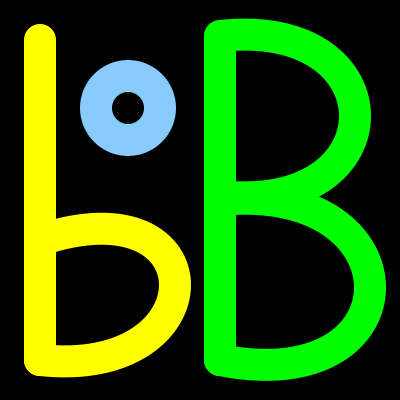

# Project logo

↑ **Parent:** [Project identity](project-identity.md)

The logo can be seen at: [Figure 1. "Logo of the OurBigBook Project"](split.md#image-logo-of-the-ourbigbook-project).

<a id="image-logo-svg"></a>


**[Figure 83](#image-logo-svg). logo.svg**. Canonical project logo.

This SVG file was actually manually created, and therefore counts as code and can be tracked on this git repository.

Since it does not contain text, only geometric primitives, this SVG file does not rely on any external system fonts and is fully reproducible.

---

<a id="image-logo-256-png"></a>


**[Figure 84](#image-logo-256-png). logo-256.png**. 256x256 PNG version of [Figure 83. "logo.svg"](#image-logo-svg), ideal for profile pictures that don't support SVG. Generated with:
```
convert logo.svg -resize 256x logo-256.png
```

---

<a id="image-logo-transparent-svg"></a>


**[Figure 85](#image-logo-transparent-svg). logo-transparent.svg**. This is a version of logo.svg with a transparent background instead of the hardcoded black background.

It was useful e.g. for t-shirt merch, where the t-shirt background choices were not perfectly black, and the black square would be visible (and possibly glossy) otherwise, which would not be nice.

---

<a id="image-logo-transparent-with-text-svg"></a>


**[Figure 86](#image-logo-transparent-with-text-svg). logo-transparent-with-text.svg**. This version of the logo was useful when designing project [T-shirts](clothing.md) on [tshirtstudio.com](tshirtstudio-com.md). On that website, you can't easily resize images with drag and drop, so:
- leaving some extra margin at the top would make the text more likely visible considering the hoodie
- leaving some extra margin around allows us to make the image a bit less huge and imposing

---

<a id="image-logo-transparent-with-text-and-slogan-2000-png"></a>


**[Figure 87](#image-logo-transparent-with-text-and-slogan-2000-png). logo-transparent-with-text-and-slogan-2000.png**. This is perhaps a superior alternative to [Figure 86. "logo-transparent-with-text.svg"](#image-logo-transparent-with-text-svg) for [merchandise](merchandise.md), as the [project slogan](project-slogan.md) could clarify further what the merchandise is all about.

<a id="image-logo-transparent-with-text-and-slogan-2000-2150-png"></a>


**[Figure 88](#image-logo-transparent-with-text-and-slogan-2000-2150-png). logo-transparent-with-text-and-slogan-2000-2150.png**. This is the same as `logo-transparent-with-text-and-slogan-2000.png` but with a 150 px border added to the top to ensure that the [tshirtstudio.com](tshirtstudio-com.md) hoodie hood won't hide the URL.

It was created with:
```
convert logo-transparent-with-text-and-slogan-2000.png -gravity north -background transparent -splice 0x150 logo-transparent-with-text-and-slogan-2000-2150.png
```

---

Some rationale:
- the lowercase `b` followed by uppercase `B` gives the idea of big and small
- the small `o` looks a bit like a degree symbol, which feels sciency. It also contributes to the idea of small to big: `o` is smallest, `b` a bit larger, and `B` actually big
- keep the same clear on black feeling as the default CSS output
- yellow, green and blue are the colors of Brazil, where [Ciro Santilli](ciro-santilli.md) was born!

It might be cool if we were able to come up with something that looks more like an actual book though instead of just using a boring lettermark.

A good point of the current design is that it suggests a certain simplicity. We want the explanations of our website to be simple and accessible to all.

**Table of contents**

- [Text logo](text-logo.md)

## ↑ Ancestors (4)

1. [Project identity](project-identity.md)
2. [Publicity](publicity.md)
3. [Developing OurBigBook](developing-ourbigbook.md)
4. [OurBigBook Project](split.md)

## ← Incoming links (1)

- [OurBigBook Project](split.md)
